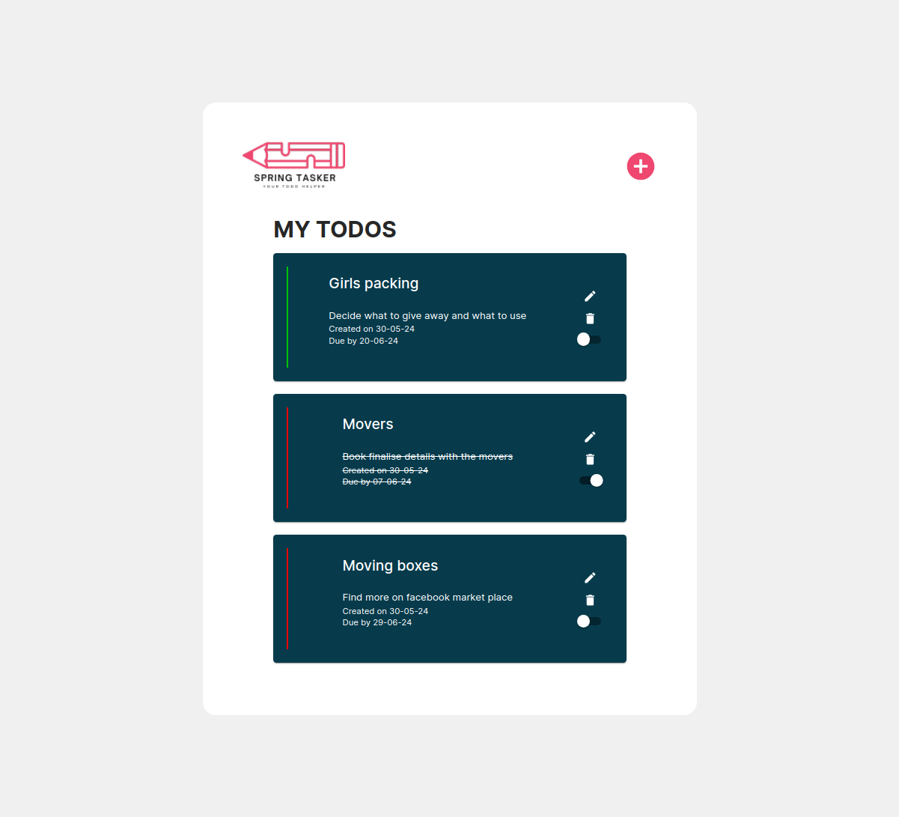

# Welcome to SpringTasker

A fullstack todo powered by React, Spring and mySql

Explore the spring API documentation at: http://localhost:8080/swagger-ui/index.html

  

 

## About

SpringTasker is a full stack application which lets you keep track of all your todos with a unique colour catergorisation to make it easier to see your most urgent todos.

## Key Features:

1. **Full CRUD:** Users are able to create, read, update and delete new todos
2. **Persisting todo:** Powered by mySql, users are able to have their todos persist between sessions
3. **Todo colour catergorisation:** Users are able to catergorise their todos by colour to make it easier to see which are your most pressing
4. **Todo Status:** Users are able to cross off todos by marking todo as complete

## Key Learning Highlights

1. **Form validation**: Navigating the form validation with Zod and React Form Hook with the intrgration of MUI components. Explored the Controller wrapper as a way of surfacing form state to the MUI componenet.
<!-- 2. **useContext**: Helped me streamline the way data is passed down through the component tree.
2. **Seeding data via dummyJson API**: Working with the admin SDK for FireBase to populate my db with products.

## Challenges

1. **Dialog element**: Issues with rendering and understanding that adding a display property to the dialog itself would negate the close() method which meant that the dialog effectively would not "close".
2. **CSS Positioning**: Working across Grid and Flexbox to get the best of each.
3. **Responsive Design**: Trying to manage how the app would be experienced across a range of device sizes - using Polypane to guide my choices to help shape a responsive experience.

## To-Dos

1. **Cart Page**: Implement UX and logic to complete the Cart functionality -->

## Screenshots

| New Todo form                               | Update Todo form                                  |
| ------------------------------------------- | ------------------------------------------------- |
|  |  |

## Technologies Used

