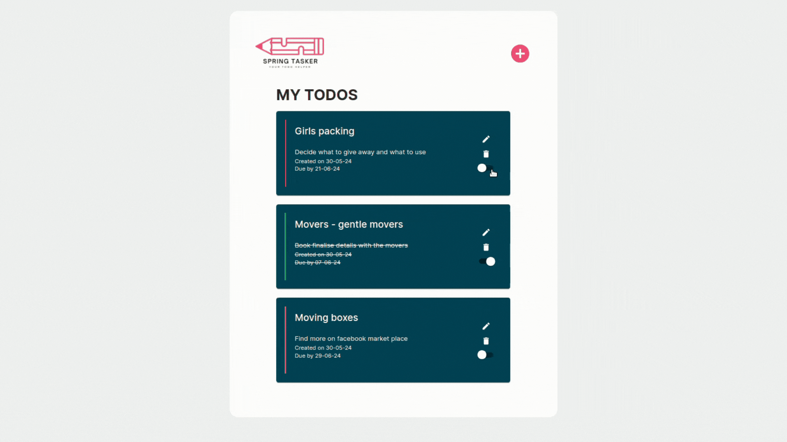
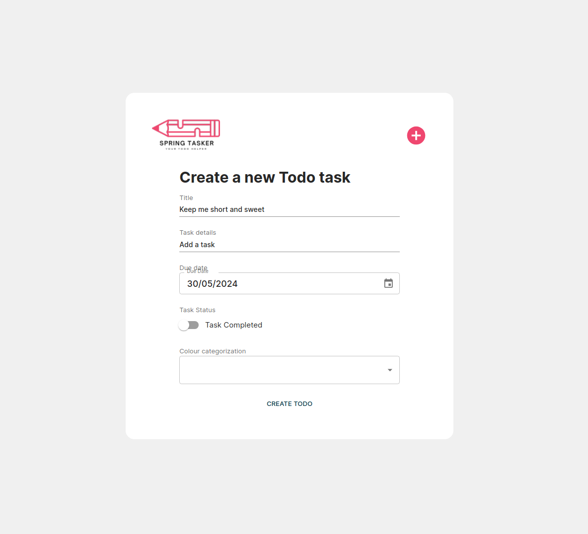
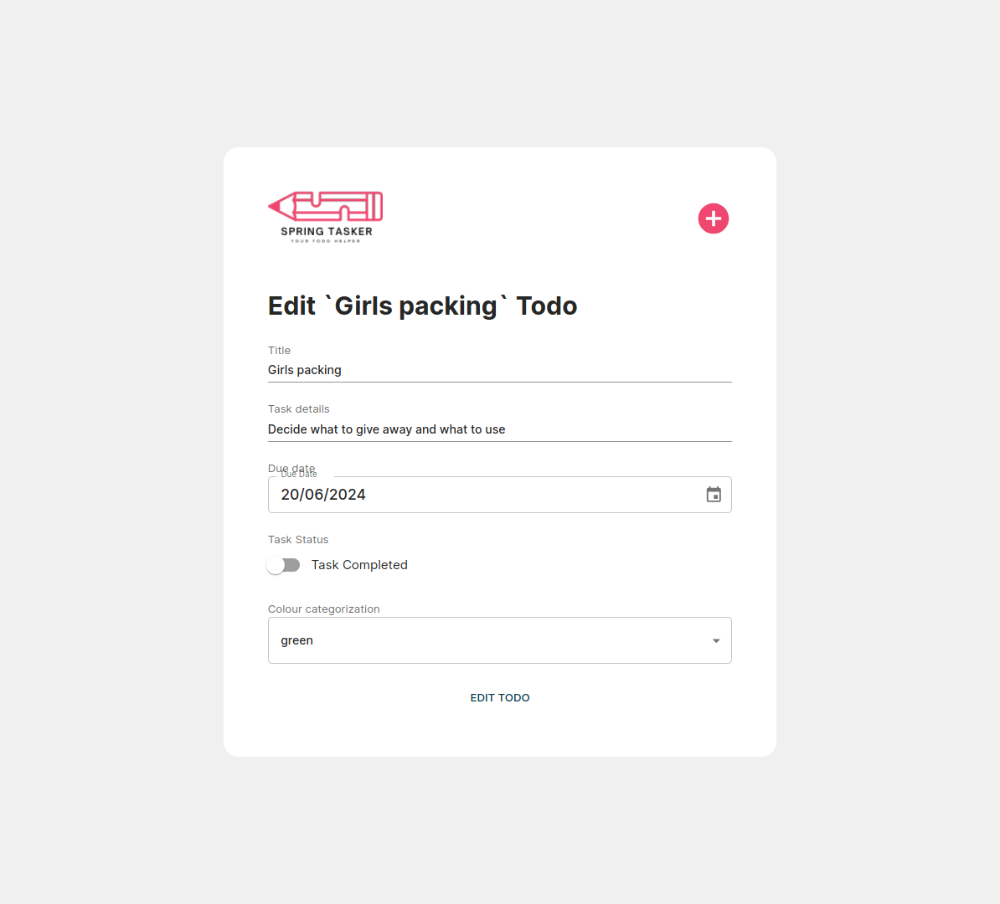

# Welcome to SpringTasker

A fullstack todo powered by React, Spring and mySql.

  

## Build Steps

1. Clone the repo.
2. Run npm install to install the relevant dependencies.
3. Start the Spring Boot backend via `TodoApplication.java`.
4. Navigate into /React and start the frontend via `npm run dev`.
5. Tests can be run in /React with `npm run test`.

## About

SpringTasker is a full-stack application that lets you keep track of all your todos with unique color categorization to make it easier to see your most urgent tasks.

Explore the spring API documentation at: http://localhost:8080/swagger-ui/index.html

## Key Features:

### Front end

1. **Full CRUD:** Users are able to create, read, update and delete new todos
2. **Persisting todo:** Powered by mySql, users are able to have their todos persist between sessions
3. **Todo colour categorization:** Users can categorize their todos by color to easily identify the most pressing tasks
4. **Todo Status:** Users can mark todos as complete to cross them off
5. **Component Testing:** Components have a range of tests to ensure elements render as expected

### Back-end

1. **CRUD API end points:** Full CRUD endpoints are provided for the Todo entity. Get all and update by ID endpoints are provided for the Color entity
2. **Logger:** Utilized Log4j2 for enhanced debugging and logging, ensuring thorough monitoring and easier maintenance of the application
3. **API documentation:** OpenAPI is added to provide clear documentation on how the API operates

## Key Learning Highlights

1. **Form validation:** Navigating form validation with Zod and React Hook Form with the integration of MUI components. Explored the Controller wrapper as a way of surfacing form state to the MUI component.
2. **React Testing Library:** Understanding how to mock functions with vi.fn() and utilize React Router DOM's MemoryRouter to mock URLs for navigation testing

## To-Dos

1. **Additional testing:** Introducing more tests across the page components to ensure the validity of the loading skeleton and error messages.
2. **Logging strategy:** Refine the error logging strategy to better surface information about internal server errors

## Screenshots

| New Todo form                                 | Update Todo form                                 | Test                                   |
| --------------------------------------------- | ------------------------------------------------ | -------------------------------------- |
|  |  |  |

## Technologies Used

